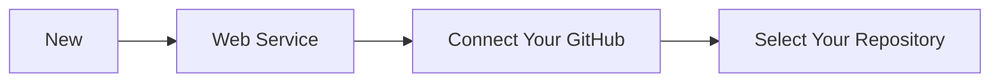
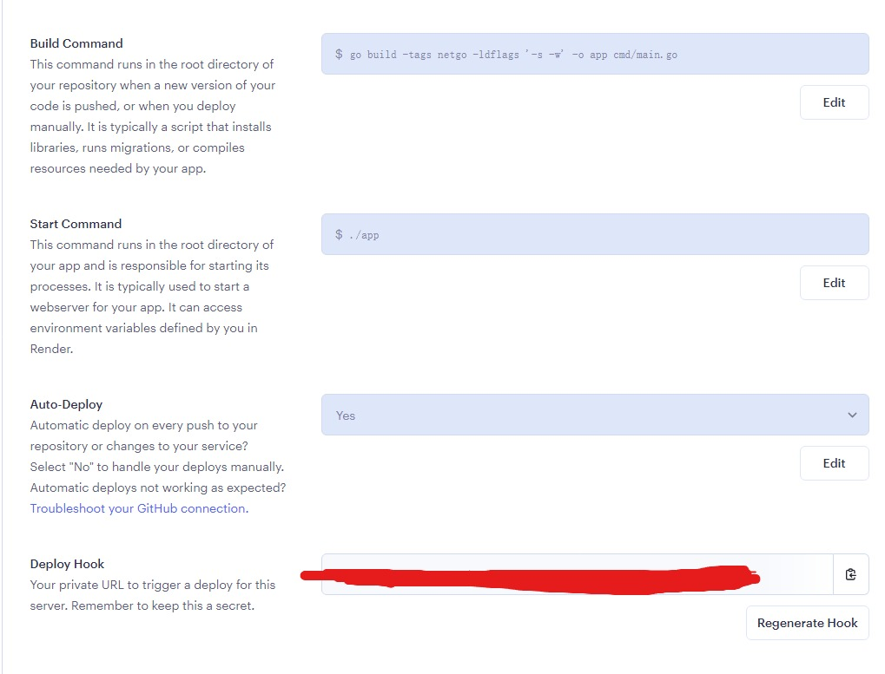

# RandomExcitement

> v1.0.0

[中文](../README.md) | English

RandomExcitement is a Go language-based API for random images. It offers a convenient way to obtain random images of different sizes and categories, catering to various needs such as testing, design, and entertainment. With a simple HTTP request, you can receive high-quality random images or URLs pointing to those images. You have the flexibility to specify parameters like width, height, format, color, blur level, or let the API choose automatically.

The categories of random images can be customized. You can manually select specific categories based on your requirements, or let the API randomly pick categories for you. RandomExcitement is released as an open-source project under the Apache 2.0 License. You can check and download the source code from GitHub, and also customize, modify, and distribute the project as needed.

We sincerely welcome your support for RandomExcitement. Feel free to give us a star, leave valuable comments and feedback. We are committed to continuous improvement and enhancing the project for a better user experience. Thank you for your attention and participation!

## Project Repository

[https://github.com/YenHarvey/RandomExcitement](https://github.com/YenHarvey/RandomExcitement)

## Features

- [x] Random Images
- [x] Specify Image Category
- [ ] Specify Image Size
- [ ] Image Cropping

## Getting Started

### Personal Server Usage

1. Download the project locally:

    ```sh
    git clone https://github.com/YenHarvey/RandomExcitement.git
    ```

2. Navigate to the project directory:

    ```sh
    cd RandomExcitement
    ```

3. Run the project:
    - Quick Run:

    ```sh
    go run cmd/main.go
    ```

    - Build and Run:
        1. Build the project:

        ```sh
        go build -tags netgo -ldflags '-s -w' -o app cmd/main.go
        ```

        2. Run the executable:

        ```sh
        ./app
        ```

### Deployment with Render

[Render Dashboard](https://dashboard.render.com/)

Clone this project to your personal GitHub repository





## API Documentation

You can access the API documentation by running the project and visiting `http://localhost:8080`.

### Initialization

#### POST Refresh Classification

POST /v1/refresh

Once you have organized your image folders, execute this endpoint to generate a configuration file named `classification.json` in the `configs` folder. This file will record all images in the `static/images` folder along with their corresponding categories.

> Response Example

> Success

```json
{
  "code": 200,
  "msg": "success",
  "data": null
}
```

##### Response Details

| Status Code | Status Meaning                                          | Description | Data Model |
| ----------- | ------------------------------------------------------- | ----------- | ---------- |
| 200         | [OK](https://tools.ietf.org/html/rfc7231#section-6.3.1) | Success     | Inline     |

##### Response Data Structure

Status Code **200**

| Name    | Type    | Required | Constraints | Chinese Name | Description |
| ------- | ------- | -------- | ----------- | ------------ | ----------- |
| » code  | integer | true     | none        |              | none        |
| » msg   | string  | true     | none        |              | none        |
| » data  | null    | true     | none        |              | none        |

### Random Images

#### GET Return All Image Categories

GET /v1/allClassifies

This endpoint returns all image categories available.

> Response Example

> 200 Response

```json
{
  "code": 0,
  "data": [
    "string"
  ],
  "msg": "string"
}
```

##### Response Details

| Status Code | Status Meaning                                          | Description | Data Model |
| ----------- | ------------------------------------------------------- | ----------- | ---------- |
| 200         | [OK](https://tools.ietf.org/html/rfc7231#section-6.3.1) | Success     | Inline     |

##### Response Data Structure

Status Code **200**

| Name    | Type     | Required | Constraints | Chinese Name | Description |
| ------- | -------- | -------- | ----------- | ------------ | ----------- |
| » code  | integer  | true     | none        |              | none        |
| » data  | [string] | true     | none        |              | none        |
| » msg   | string   | true     | none        |              | none        |

#### GET Get Random Image

GET /v1/randomExcitement

Redirects to a random image link from all available categories.

> Response Example

> 200 Response

##### Response Details

| Status Code | Status Meaning                                          | Description | Data Model |
| ----------- | ------------------------------------------------------- | ----------- | ---------- |
| 200         | [OK](https://tools.ietf.org/html/rfc7231#section-6.3.1) | Success     | Inline     |

##### Response Data Structure

#### POST Get Random Image

POST /v1/randomExcitement

Returns a random image link in JSON format from all available categories.

> Response Example

> 200 Response

```json
{
  "code": 0,
  "data": "string",
  "msg": "string"
}
```

##### Response Details

| Status Code | Status Meaning                                          | Description | Data Model |
| ----------- | ------------------------------------------------------- | ----------- | ---------- |
| 200         | [OK](https://tools.ietf.org/html/rfc7231#section-6.3.1) | Success     | Inline     |

##### Response Data Structure

Status Code **200**

| Name    | Type    | Required | Constraints | Chinese Name | Description |
| ------- | ------- | -------- | ----------- | ------------ | ----------- |
| » code  | integer | true     | none        |              | none        |
| » data  | string  | true     | none        |              | none        |
| » msg   | string  | true     | none        |              | none        |

#### POST Get Image by User Request

POST /v1/random

Returns a random image link in JSON format based on the user's specified category.

##### Request Parameters

| Name     | Location | Type    | Required | Description |
| -------- | -------- | ------- | -------- | ----------- |
| classify | query    | string  | true     | none        |

> Response Example

> 200 Response

```json
{
  "code": 0,
  "data": "string",
  "msg": "string"
}
```

##### Response Details

| Status Code | Status Meaning                                          | Description | Data Model |
| ----------- | ------------------------------------------------------- | ----------- | ---------- |
| 200         | [OK](https://tools.ietf.org/html/rfc7231#section-6.3.1) | Success     | Inline     |

##### Response Data Structure

Status Code **200**

| Name    | Type    | Required | Constraints | Chinese Name | Description |
| ------- | ------- | -------- | ----------- | ------------ | ----------- |
| » code  | integer | true     | none        |              | none        |
| » data  | string  | true     | none        |              | none        |
| » msg   | string  | true     | none        |              | none        |

#### GET Get Image by User Request

GET /v1/random

Redirects to a random image link based on the user's specified category.

##### Request Parameters

| Name     | Location | Type    | Required | Description |
| -------- | -------- | ------- | -------- | ----------- |
| classify | query    | string  | true     | none        |

> Response Example

> 200 Response

##### Response Details

| Status Code | Status Meaning                                          | Description | Data Model |
| ----------- | ------------------------------------------------------- | ----------- | ---------- |
| 200         | [OK](https://tools.ietf.org/html/rfc7231#section-6.3.1) | Success     | Inline     |

##### Response Data Structure

## Acknowledgments

<div style="display: flex; flex-direction: row;">
       <div style="margin-right: 10px;">
           <a href="https://img.shields.io/badge/gin-v1.6.3-green">
               
           </a>
       </div>
       <div style="margin-right: 10px;">
           <a href="https://img.shields.io/badge/GoLand-2020.2.3-green">
               
           </a>
       </div>
       <div style="margin-right: 10px;">
           <a href="https://img.shields.io/badge/Go-v1.20.0-green">
               
           </a>
       </div>
     <div style="margin-right: 10px;">
        <a href="https://img.shields.io/badge/Apifox-v2.3.11-green">
            
        </a>
      </div>
      <div style="margin-right: 10px;">
        <a href="https://img.shields.io/badge/license-Apache%202-blue">
            
        </a>
      </div>
</div>
